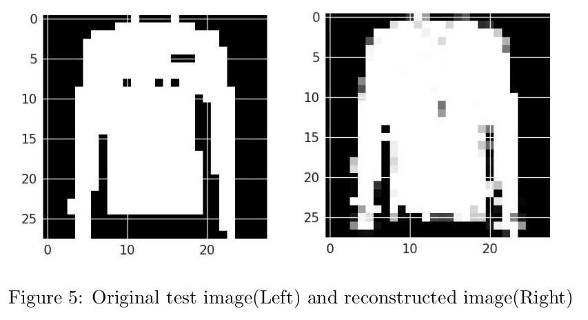
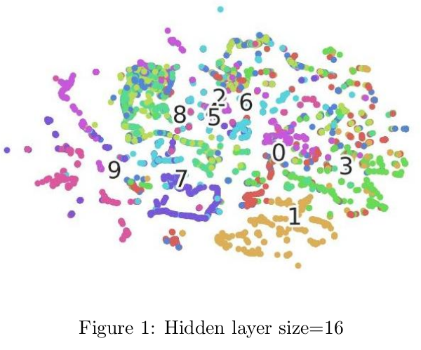
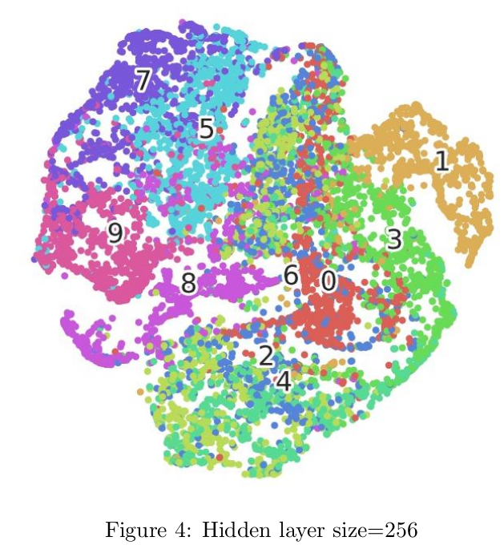

# restricted-boltzmann-machine
This is an implementation of Restricted Boltzmann Machine (RBM). This does not use any high-level libraries like Keras, Tensorflow. Contrastive Divergence algorithm is used to train the RBM which is then used to compute the hidden representations of Fashion MNIST data (784 dimentional, 10 classes data). 

* Images are re-constructed back from the hidden representations, after 20 epochs of training the RBM model.

* t-SNE visualization for the learnt vector representations with different hidden sizes. The numbers marked are the respective classes to which the vectors belong to. At hidden size 256, it is evident that vectors of the same class come close to each other.

 

## Steps to train/test
1. Download "train.csv" and "test.csv" from <a href="https://drive.google.com/drive/folders/18t_LQ0srPx16xD9ZZqa32ICOP2QDzgZj?usp=sharing">here</a> and put it in the same directory as train.py.
2. To train the model from scratch, run:  
       `bash run.sh`
       
## Conclusions
Project_Report.pdf can be referred for more detailed results and other experimental observations.
    
## Authors
<a href="https://github.com/madhurapande19">Madhura Pande</a>

<a href="https://github.com/AakritiBudhraja">Aakriti Budhraja</a> 
